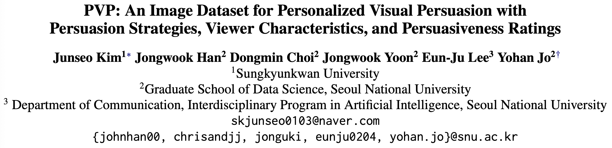
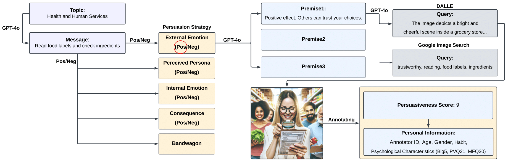
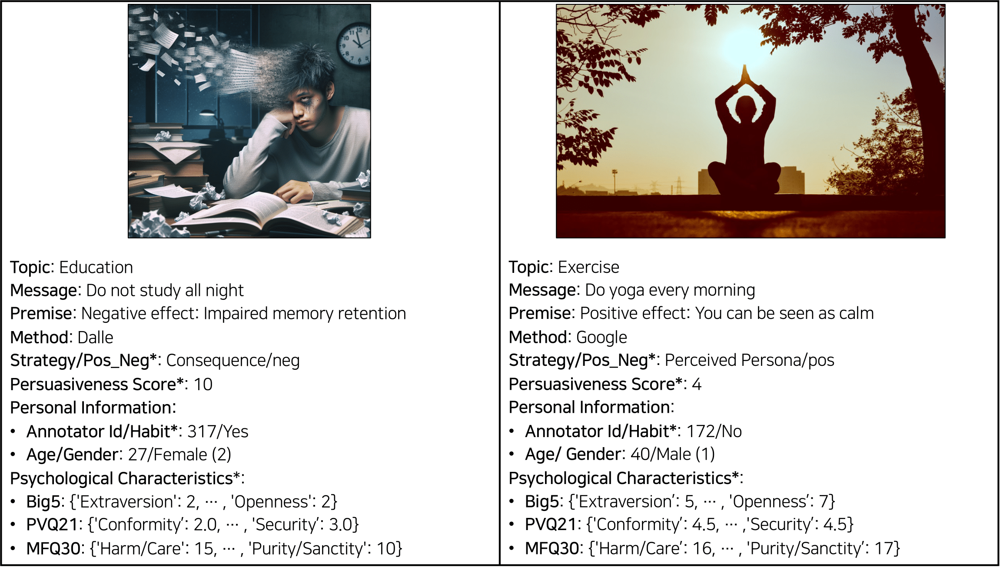

<div> 


<h1> PVP: An Image Dataset for Personalized Visual Persuasion with Persuasion Strategies, Viewer Characteristics, and Persuasiveness Ratings



</div>
 

<div align="center">

[](https://arxiv.org/abs/2506.00481)
[](https://arxiv.org/pdf/2506.00481)

[]()
[]()



</div>

To address the limitation of existing datasets that do not sufficiently provide information about the relationship between persuasion effectiveness and the persuadee’s psychological characteristics (e.g., personality and values), we construct and release the Personalized Visual Persuasion (PVP) dataset.

The PVP dataset consists of 28,454 persuasive images related to 596 messages across 20 topics inspired by U.S. government departments and agencies. These messages are designed to influence viewer behaviors (e.g., “Do not smoke”). A distinctive feature of our dataset is the incorporation of nine persuasion strategies based on theoretical frameworks (e.g., gain frame: depicting a positive consequence of the target behavior). To enable images to reflect these strategies, we employed a novel method of generating images using DALLE and additionally sourced images through Google Image Search.

Recognizing that the persuadee’s psychological characteristics play a crucial role in persuasion effectiveness, we collected persuasiveness scores for the images, along with annotators’ demographics, habits, Big 5 personality traits, and values.

In addition, we are releasing a persuasive image generator and an automated evaluator, which establish benchmark baselines and pave the way for future research in AI-driven persuasion.

## 📢 Updates

### 🆕 2025-05-28: Official Version Released!

This is now the official repository of the project!  
For additional information, experiments, or earlier versions, please refer to the original personal repository [here](https://github.com/JunseoKim0103/PVP_Personalized_Visual_Persuasion).


### 2025-01-24: Major Update!  

We are excited to announce significant advancements in our personalized visual persuasion research.  

🚀 Key Highlights of This Update  

1. **📂 PVP Dataset Release**  
   - Includes **28,454 persuasive images** covering **596 messages and 9 persuasion strategies.**  
   - Evaluated by **2,521 human annotators** with detailed demographic and psychological profiles, including personality traits and values.  

2. **🛠️ PVP Dataset Construction Framework**  
   - A comprehensive framework for data collection, processing, and organization.  
   - Designed to facilitate future research in personalized visual persuasion.  

3. **⚙️ Generator & Evaluator Tools**  
   - **Persuasive Image Generator:** Generates personalized persuasive content based on user profiles.  
   - **Automated Evaluator:** Assesses the persuasiveness of images using established benchmarks, paving the way for AI-driven persuasion advancements.  

Stay tuned for the official release of the PVP dataset!  
Meanwhile, check out our [latest paper](https://arxiv.org/pdf/2506.00481) to explore our findings and contributions.

<div align="center">

</div>

## Datasets
<div align="center">




</div>
The upper figure shows two examples from the dataset.

A distinctive feature of our dataset is the utilization of **nine persuasion strategies** based on **theoretical frameworks** (e.g., gain frame: depicting a positive consequence of the target behavior). To ensure that these strategies are effectively reflected in the images, we employed a **novel image generation method using DALLE** and additionally sourced images via **Google Image Search**.

Furthermore, recognizing that the characteristics of viewers play a crucial role in persuasion effectiveness, we collected **persuasiveness scores** for the images, along with annotators’ **demographic information, habits, personality traits (Big 5 personality traits, Goldberg, 2013), and values (Schwartz, 2012; Graham et al., 2013).**

<!-- You can get our datasets via this [Google Drive](https://drive.google.com/drive/u/0/folders/1h_OQhtCUkpyMy82o6VDR8_PXiYpZ0uX1). -->


# 💾 Installation

## Prepare the Environment File
We are currently using **OpenAI’s API** for data construction.

Please create a `.env` file in the root directory of the repository to securely store the required API keys.

Sample `.env` file containing private information:
```
OPENAI_API_KEY='your-api-key-here'"
```
OPENAI_API_KEY is the OpenAI API key. You can get it from the [OpenAI](https://platform.openai.com/api-keys).


## Setup

### Python Environment
Please setup your python environment and install the required dependencies as:
```bash
# Clone the repository
git clone https://github.com/holi-lab/PVP_Personalized_Visual_Persuasion.git
cd PVP_Personalized_Visual_Persuasion

# Create a new conda environment
conda create --name PVP-DEV python=3.12
conda activate PVP-DEV
pip install -r requirements.txt
```

# 📊 Data Construction

### 1. **DALL·E Generation**
- We generated a single image for each query using **GPT-4o**.  
- For more details, please refer to the **README** in `./data_construction/dalle`.

### 2. **Google Image Search**
- We used **Serper API** to collect **40 images per query** from Google Image Search.  
- To filter out images containing excessive text, we applied **easyOCR**, which analyzes the text within images.  
- Images with **more than 20 characters** detected with an OCR confidence score of **95% or higher** were excluded.  
  - The filtered images can be found in `./data_construction/ocr_image`.  
- After the filtering process, the remaining images underwent validation, and the **top 3 images** that passed were included in the dataset. (Refer to the **Validation** section below.)

### 3. **Validation**
We used **GPT-4o** to validate whether the collected images effectively convey the intended message.

Initially, we observed that GPT-4o tended to assign overly high scores, even when images did not fully align with the intended premise.  
To improve the evaluation process, we implemented a two-step validation approach:

1. **Image Interpretation:**  
   - GPT analyzes the image to understand its meaning.  
   
2. **Premise Alignment:**  
   - The interpretation is evaluated against the intended message using tailored prompts for different persuasion strategies.  

Additionally, we applied an **automated content filtering protocol** to remove offensive material. This was followed by a **manual review** to eliminate any violent, offensive, or inappropriate content.  
- The validation process details can be found in `./data_construction/gpt_eval`.


# 🚀 Evaluator & Generator

You can access the Evaluator and Generator in `./model`.
- Generator: Responsible for generating personalized persuasive images. In our model, instead of directly creating images, it generates descriptions that can be used by an image generation model.
- Evaluator: Assesses the persuasiveness of the generated images tailored to target viewers.

For more detailed information, please refer to the README file inside the respective folder.


# 🌲 File Structure
This section provides an overview of the core directories and organizational structure of the our paper's source code.
For detailed descriptions of each directory, please refer to the README file within the respective directory.
```
PVP_Personalized_Visual_Persuasion
├── README.md
├── data_analysis
├── data_contruction
│   ├── bootstrap
│   ├── dalle
│   │   └── dalle_generate_image.py
│   ├── gpt_eval
│   │   └── gpteval_image.py
│   └── ocr_image
│       └── ocr_example.py
├── eval_annotation
│   ├── filtering.py
│   ├── reduce_duplicated_image.py
│   ├── score.py
│   └── survey_result.py
└── model
    ├── README.md
    ├── data_preprocessing
    │   ├── data
    │   ├── prompt_csv_to_json.py
    │   └── prompt_generator.py
    ├── evaluator
    │   ├── config
    │   │   ├── big5
    │   │   ├── mfq30
    │   │   ├── none
    │   │   └── pvq21
    │   │       ├── prompt1_pvq21_indomain_1epoch.yaml
    │   │       ├── prompt1_pvq21_indomain_1epoch_dalle.yaml
    │   │       ├── prompt1_pvq21_indomain_1epoch_filter.yaml
    │   │       └── prompt1_pvq21_indomain_1epoch_google.yaml
    │   ├── data
    │   │   ├── big5
    │   │   │   ├── eval_data_prompt1_big5.json
    │   │   │   ├── test_data_prompt1_big5.json
    │   │   │   └── train_data_prompt1_big5.json
    │   │   ├── mfq30
    │   │   │   ├── eval_data_prompt1_mfq30.json
    │   │   │   ├── test_data_prompt1_mfq30.json
    │   │   │   └── train_data_prompt1_mfq30.json
    │   │   ├── none
    │   │   │   ├── eval_data_prompt1_none.json
    │   │   │   ├── test_data_prompt1_none.json
    │   │   │   └── train_data_prompt1_none.json
    │   │   └── pvq21
    │   │       ├── dalle
    │   │       ├── filter
    │   │       ├── final
    │   │       │   ├── eval_data_prompt1_pvq21.json
    │   │       │   ├── test_data_prompt1_pvq21.json
    │   │       │   └── train_data_prompt1_pvq21.json
    │   │       └── google
    │   ├── metric
    │   │   ├── dataloader.py
    │   │   ├── metric_evaluator.py
    │   │   └── metric_generator.py
    │   └── model
    │       ├── dataloader.py
    │       ├── inference.py
    │       ├── run_training_pvq21.sh
    │       └── train.py
    └── generator
        ├── config
        │   ├── generator_prompt1_pvq21_indomain_over8_1epoch.yaml
        │   └── ...
        ├── data
        │   ├── generator_test.json
        │   ├── gpt
        │   │   ├── gpt_4o_mini_test.json
        │   │   └── gpt_4o_test.json
        │   ├── over7
        │   ├── over8
        │   │   ├── generator_eval_paper_over8.json
        │   │   ├── generator_test_paper_over8.json
        │   │   └── generator_train_paper_over8.json
        │   └── over9
        └── model
            ├── dataloader.py
            ├── formatter.py
            ├── generator_gpt_zero_shot.py
            ├── inference.py
            ├── run_training_over7.sh
            └── train.py
```

# 📚 Abstract
Visual persuasion, which uses visual elements to influence cognition and behaviors, is crucial in fields such as advertising and political communication.
With recent advancements in artificial intelligence, there is growing potential to develop persuasive systems that automatically generate persuasive images tailored to individuals.
However, a significant bottleneck in this area is the lack of comprehensive datasets that connect the persuasiveness of images with the personal information about those who evaluated the images. 
To address this gap and facilitate technological advancements in personalized visual persuasion, we release the Personalized Visual Persuasion (PVP) dataset, comprising 28,454 persuasive images across 596 messages and 9 persuasion strategies. 
Importantly, the PVP dataset provides persuasiveness scores of images evaluated by 2,521 human annotators, along with their demographic and psychological characteristics (personality traits and values). 
We demonstrate the utility of our dataset by developing a persuasive image generator and an automated evaluator, and establish benchmark baselines.
Our experiments reveal that incorporating psychological characteristics enhances the generation and evaluation of persuasive images, providing valuable insights for personalized visual persuasion.


# 😀 Authors and Citation
**Junseo Kim**, Jongwook Han, Dongmin Choi, Jongwook Yoon, Eun-Ju Lee, **Yohan Jo\***

Please cite our paper if you use the code or data in this repository.
```
@inproceedings{kim-etal-2025-pvp,
   title = "{PVP}: An Image Dataset for Personalized Visual Persuasion with Persuasion Strategies, Viewer Characteristics, and Persuasiveness Ratings",
   author = "Kim, Junseo and Han, Jongwook and Choi, Dongmin and Yoon, Jongwook and Lee, Eun-Ju and Jo, Yohan",
   booktitle={ACL},
   year={2025}
}
```

